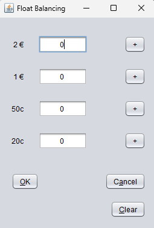

# Welcome to Vending Machine Desktop App

A Vending Machine application for the first college project, built with Java Swing.

**Presentation:** Coming soon

## Example Screenshots

## Features

* **Cash & Card Payment:** Users can pay by card or cash.
* **Float Monitoring:** Automatically calculates the float inside the machine after each insert and withdrawal.
* **Stock Order % Control:** If the product is out of stock, it gives a warning pop-up and asks for stock ordering.
* **Cancel buying:** Refund the cancellation transaction

## Tech Stack

* **Backend:** Java Swing
* **Version Control:** Git / GitHub

## Challenges & Lessons Learned

"A key challenge was simulating a realistic card payment process, which required a timed delay without freezing the user interface. I solved this by implementing the javax.swing.Timer class to create a non-blocking delay. 
This allowed me to display a "Processing..." message for a few seconds before showing the transaction result, creating a much smoother and more intuitive user experience."
